# Computer Vision with Mobile Robot

**Duration:** 02/2025 – 03/2025  
**Tags:** `Computer Vision` · `Mobile Robot` · `Python`

---

## Objective

I developed a computer vision pipeline that extracts locale and path information from map images. The extracted data is then used to plan and execute the trajectory of a virtual differential mobile robot.

<table align="center">
  <tr>
    <td align="center">
      <br/>
      <sub>Example map image</sub>
    </td>
    <td align="center">
      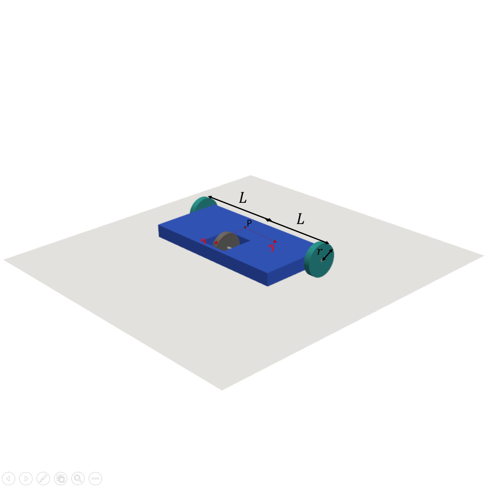<br/>
      <sub>Modeled mobile robot</sub>
    </td>
  </tr>
</table>


### Pipeline Overview

```
Map Image
   ├── Locale Extraction  →  Start & End Points
   └── Path Extraction    →  Pathway & Boundaries
                                     ↓
                          Differential Mobile Robot
                          (Kinematics + Trajectory Planning)
```


<p align="center">
  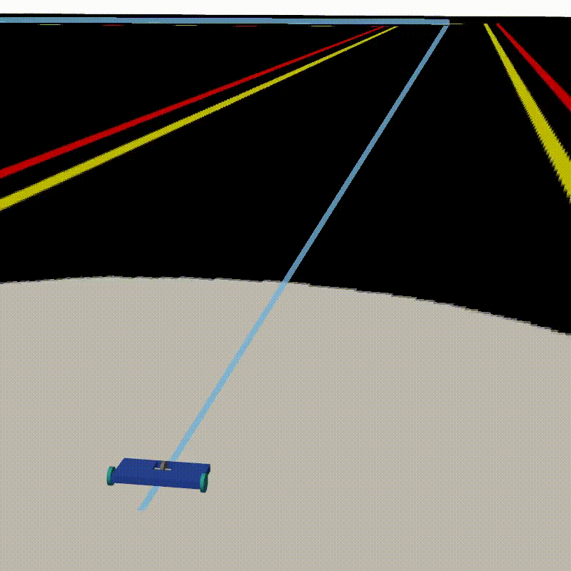<br/>
  <sub>Modeled motion along the map</sub>
</p>


## 1. Computer Vision — Locale Extraction

Extracts the position of circular markers from the target map, identifying the **start** and **end** points for the robot's motion.

**Processing steps:**

1. **Color classification** — preliminary noise filtering to isolate blue and green markers

<table align="center">
  <tr>
    <td align="center">
      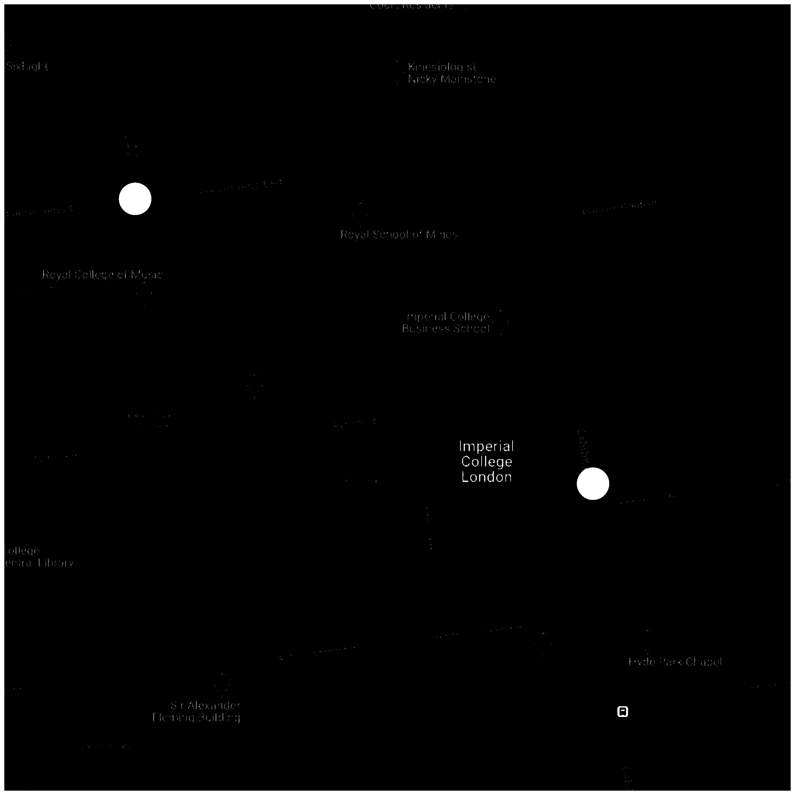<br/>
      <sub>Example map image</sub>
    </td>
    <td align="center">
      <br/>
      <sub>Modeled mobile robot</sub>
    </td>
  </tr>
</table>

2. **Erosion** — removes noise and picks out target circular shapes
3. **Dilation** — recovers the size of the markers after erosion

<table align="center">
  <tr>
    <td align="center">
      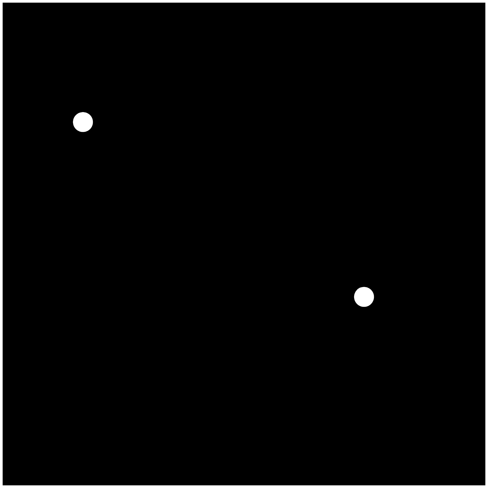<br/>
      <sub>Example map image</sub>
    </td>
    <td align="center">
      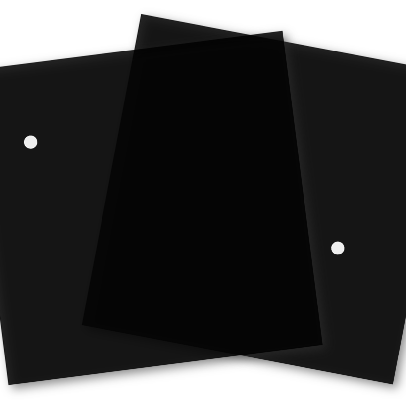<br/>
      <sub>Modeled mobile robot</sub>
    </td>
  </tr>
</table>

4. **Connected-component labeling (CCL)** — separates the two blue markers into distinct components

<!-- **Relevant outputs:** `images/blue_class.png`, `images/green_class.png`, `images/ero_blue.png`, `images/ero_green.png`, `images/dil_blue.png`, `images/dil_green.png`, `images/post_ccl.png` -->

---

## 2. Robot Vision — Path Extraction

Extracts the red boundary-defining lines from the target map, providing the **pathway** and **boundaries** for robot motion.

**Processing steps:**

<!--

<details>
<summary>
1. <strong>Color classification</strong> — preliminary noise filtering to isolate red lines
</summary>

<p align="center">
  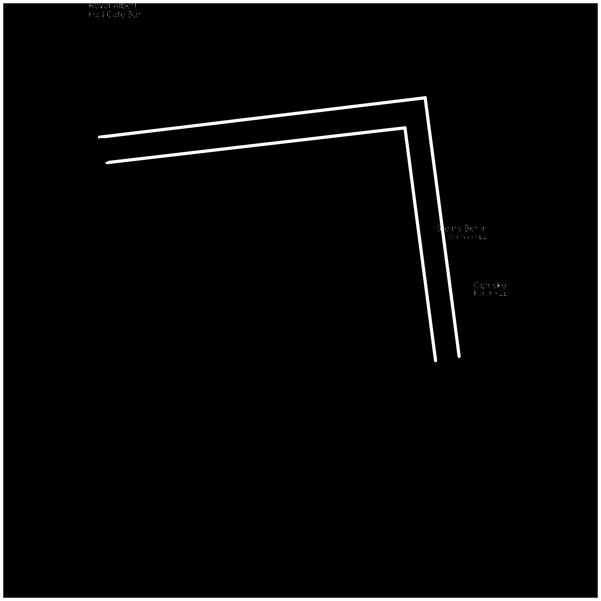<br/>
  <sub>Post color classification (red lines)</sub>
</p>

</details>

<details>
<summary>
2. <strong>Edge detection</strong> — detects edges and prepares the image for line extraction
</summary>

<p align="center">
  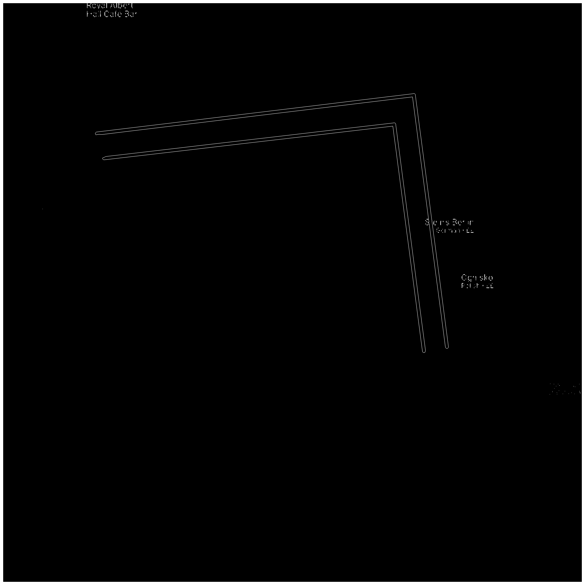<br/>
  <sub>Post edge detection (redlines)</sub>
</p>

</details>

<details>
<summary>
3. <strong>Line extraction (Hough Transform)</strong> — to only extract line-shaped edges
</summary>

<table align="center">
  <tr>
    <td align="center">
      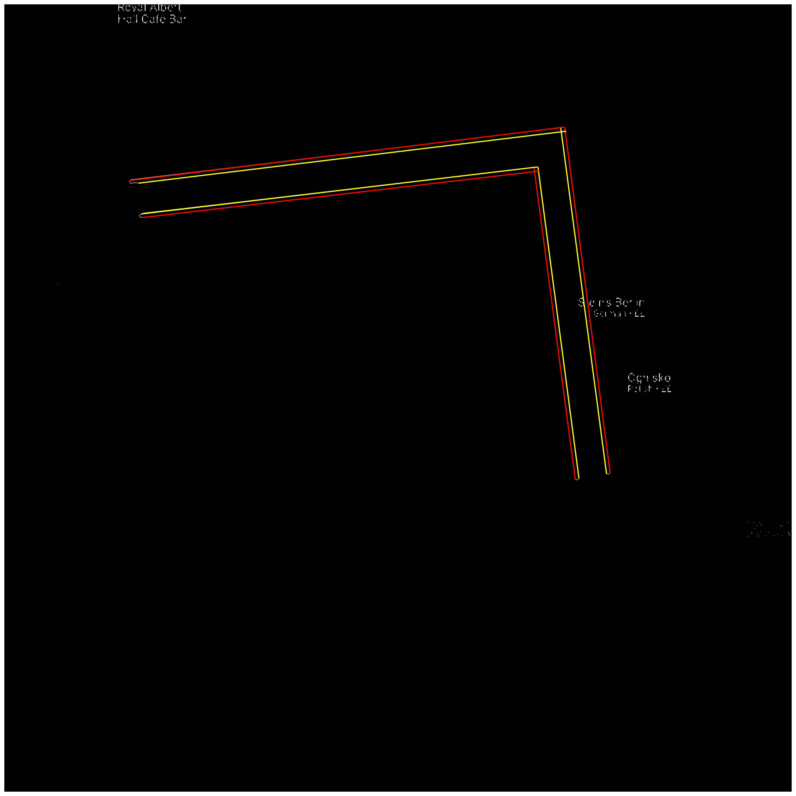<br/>
      <sub>Post line extraction (red lines)</sub>
    </td>
    <td align="center">
      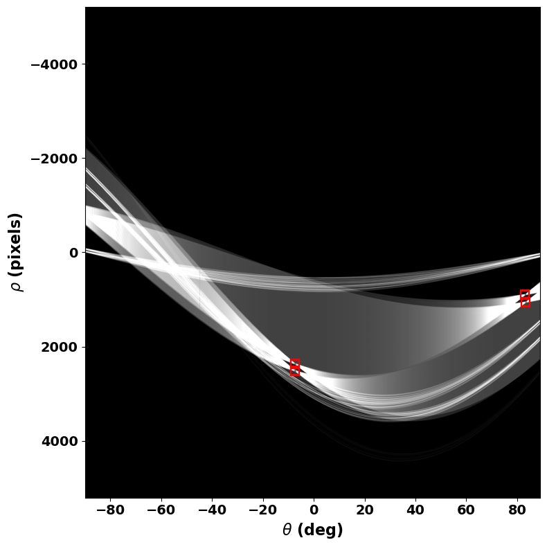<br/>
      <sub>Hough transform identifying edge elements</sub>
    </td>
  </tr>
</table>

</details>

--->


1. **Color classification** — preliminary noise filtering to isolate red lines
2. **Edge detection** — detects edges and prepares the image for line extraction
<table align="center">
  <tr>
    <td align="center" style="border: none;">
      <br/>
      <sub>Post color classification (red lines)</sub>
    </td>
    <td align="center">
      <br/>
      <sub>Post edge detection (redlines)</sub>
    </td>
  </tr>
</table>

3. **Line extraction (Hough Transform)** — extracts line-shaped edges from the edge-detected image
<table align="center" style="border: none;">
  <tr>
    <td align="center">
      <br/>
      <sub>Hough transform identifying edge elements</sub>
    </td> 
    <td align="center">
      <br/>
      <sub>Post line extraction (red lines)</sub>
    </td>
  </tr>
</table>


<!--
**Relevant outputs:** `images/red_class.png`, `images/edge_detection.png`, `images/finite_lines.png`, `images/hough_plot.png`
--->

---

## 3. Mobile Robot

- I designed a differential mobile robot configuration, with fully derived kinematics
- I planned a motion that executes the trajectory information extracted previously.


<details>
<summary> Kinematics (click to expand) </summary>

<br>
The kinematics was fully derived under the assumptions of **no sliding** and **no slipping**.

The kinematic constraint is expressed as:

$$\begin{pmatrix} 1 & 0 & -L \\\\ 1 & 0 & L \\\\ 0 & 1 & 0 \end{pmatrix} {}_{I}^{0}R \; {}^{I}\dot{P} = \begin{pmatrix} r & 0 \\\\ 0 & r \\\\ 0 & 0 \end{pmatrix} \begin{pmatrix} \omega_L \\\\ \omega_R \end{pmatrix}$$

where:
- $\omega_L$, $\omega_R$ — forward rotation speed of the left and right wheels
- ${}^I_0R$ — rotation matrix between the robot local frame and the global frame
- ${}^I\dot{P}$ — velocity of the midpoint of the robot in the global frame

This leads to the formulation used during turning:

$${}^{I}\dot{P} = \begin{pmatrix} \omega R\cos\theta \\\\ \omega R\sin\theta \\\\ \omega \end{pmatrix}, \qquad \begin{pmatrix} \dot{\psi}_1 \\\\ \dot{\psi}_2 \end{pmatrix} = \begin{pmatrix} \omega\frac{R-L}{r} \\\\ \omega\frac{R+L}{r} \end{pmatrix}$$

where $R$ is the turning radius and $\omega$ is the angular velocity of the robot body.

</details>


### Trajectory Planning

A Continuous acceleration profile was enforced throughout the trajectory to reduce mechanical stress on the robot's physical components

<table align="center" style="border: none;">
  <tr>
    <td align="center">
      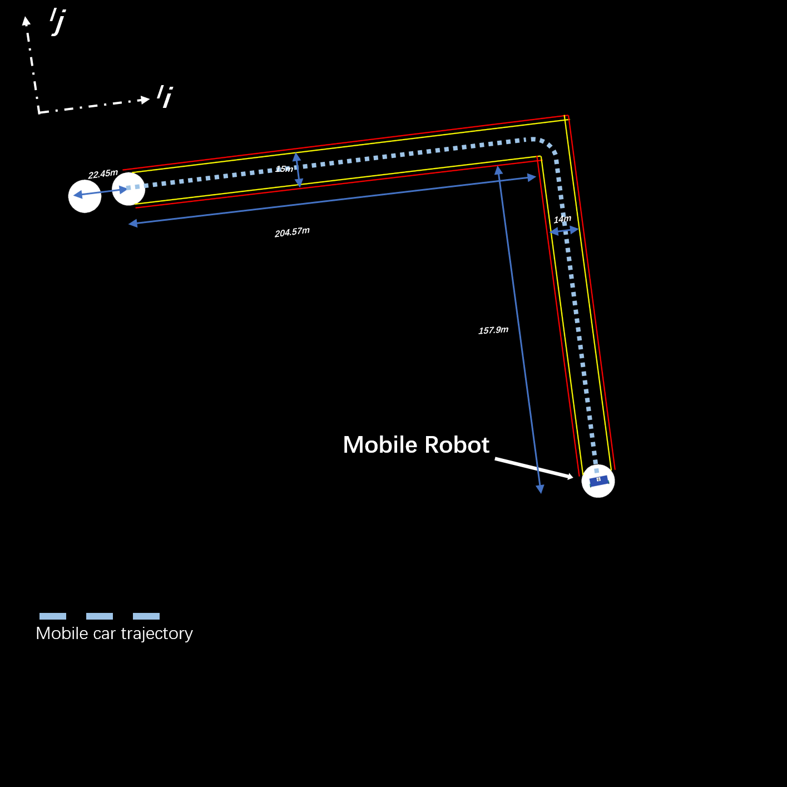<br/>
      <sub>Trajectory information with real world dimensions</sub>
    </td> 
    <td align="center">
      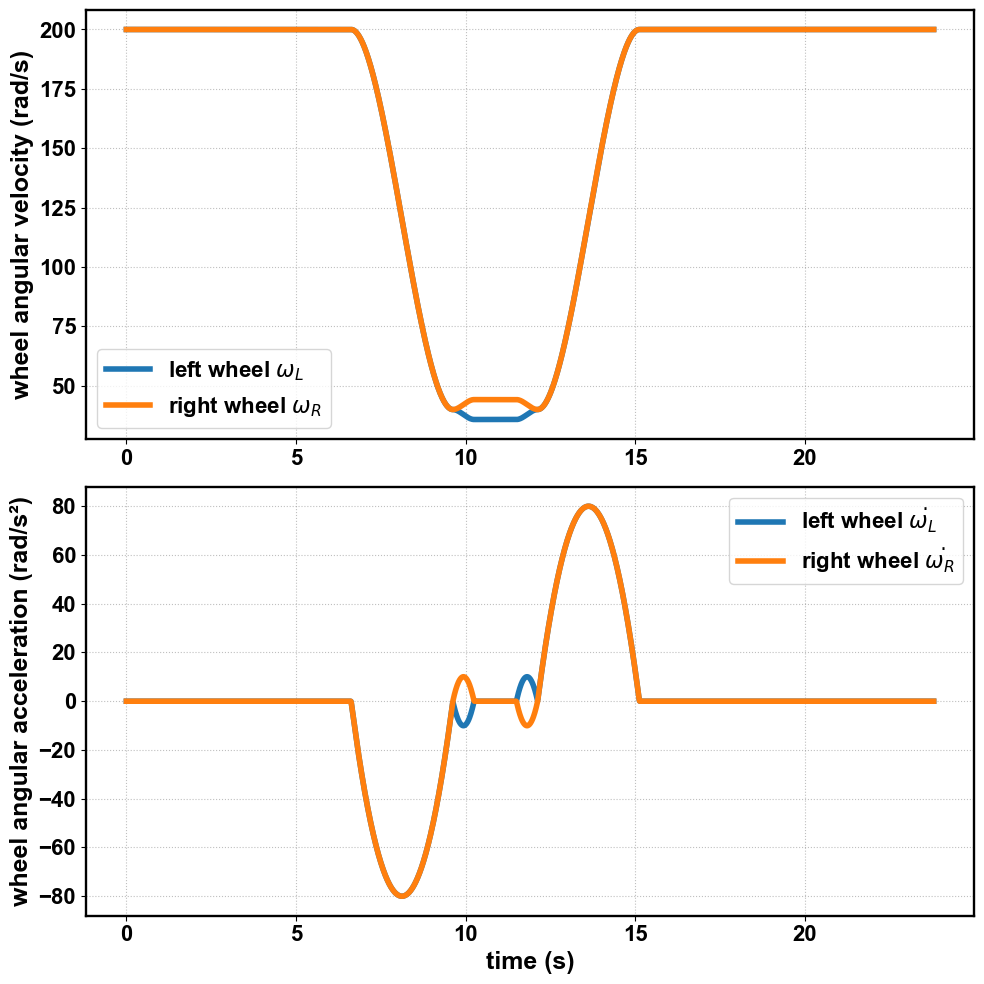<br/>
      <sub>Velocity and acceleration profile of the two wheels along the trajectory</sub>
    </td>
    <td align="center">
      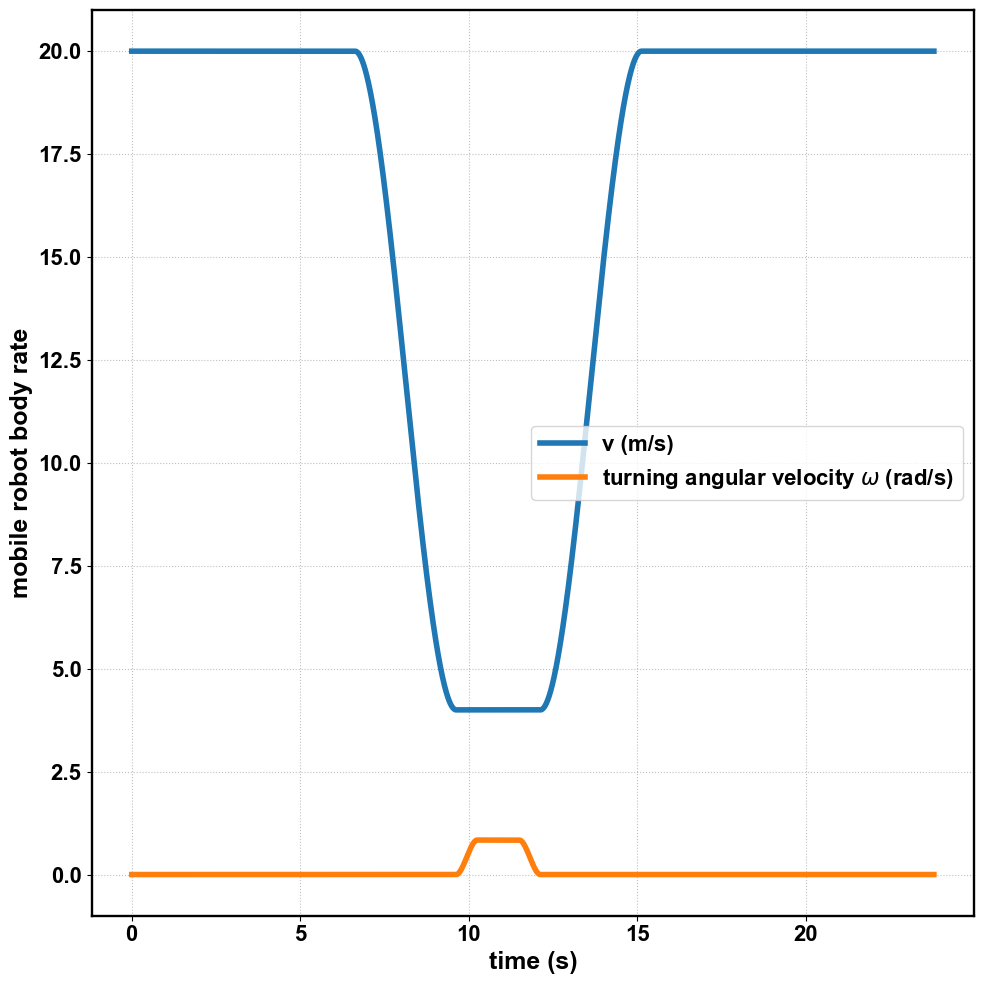<br/>
      <sub>Velocity and angular velocity of the mobile robot along the trajectory</sub>
    </td>
  </tr>
</table>


---

<!--## File Structure

```
.
├── index.html
└── images/
    ├── background.png
    ├── map.png                  # Target map
    ├── blue_class.png           # Color classification — blue markers
    ├── green_class.png          # Color classification — green marker
    ├── ero_blue.png             # Post erosion — blue markers
    ├── ero_green.png            # Post erosion — green marker
    ├── dil_blue.png             # Post dilation — blue markers
    ├── dil_green.png            # Post dilation — green marker
    ├── post_ccl.png             # Post connected-component labeling
    ├── red_class.png            # Color classification — red lines
    ├── edge_detection.png       # Post edge detection
    ├── finite_lines.png         # Post line extraction
    ├── hough_plot.png           # Hough transform visualisation
    ├── config.png               # Differential mobile robot configuration
    ├── map_w_mobile.png         # Trajectory with real-world dimensions
    ├── va_profile.png           # Wheel velocity & acceleration profiles
    ├── body_v_profile.png       # Robot body velocity & angular velocity profiles
    └── diffbot_motion.mp4       # Trajectory animation
```

---
-->

## Future Work

- Integrate the pipeline with standard ROS2 architecture.
- Prototype a physical mobile robot with a real-time **camera system** to capture live visual data from the environment.
- Implement **obstacle detection** and **real-time replanning** to allow the robot to adapt to uncertain environments.
